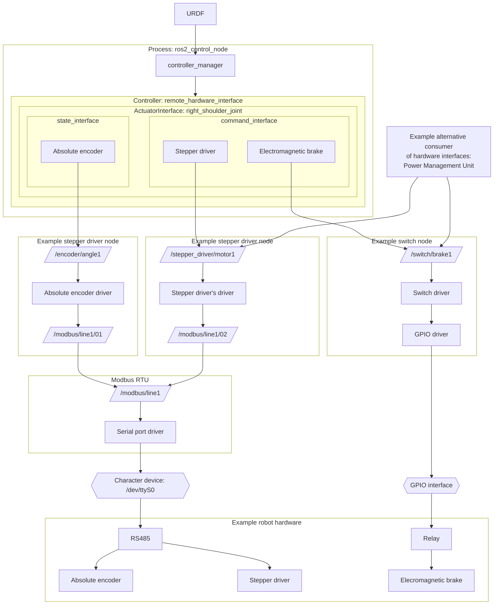

# OpenVMP

[](./LICENSE.txt)

This package is a part of [the OpenVMP project](https://github.com/openvmp/openvmp).
But it's designed to be universal and usable independently from the rest of OpenVMP or in a combination with select OpenVMP packages.

## remote\_motion\_hardware

This package implements a hardware interface plugin for ros2\_control
and proxies requests to compatible nodes that actually implement the hardware
control.

This is useful to access remote hardware (over the network) or to access
heavy hardware modules that are not designed for an exclusive use by
the ros2\_control\_node (e.g. for independent power consumption control,
troubleshooting/introspection, audit log recording,
or other non-motion-control related operations).
Examples of such hardware modules include:

- Stepper motor drivers that have ROS2 packages based on the
  [stepper\_driver](https://github.com/openvmp/stepper_driver/) interface:
  - [stepper\_driver\_em2rs](https://github.com/openvmp/stepper_driver_em2rs/)
- Electromagnetic brakes controlled by relay boards compatible with:
  - [R413D08](https://github.com/openvmp/switch_r413d08/)


### How to

#### Configuration

Add the following to the URDF files:

```
  <hardware>
    <plugin>remote_motion_hardware/ActuatorInterface</plugin>
    <param name="prefix">/robot1</param>
  </hardware>
```

- prefix: the prefix to ROS2 interfaces

  E.g. if the prefix is "/robot1" then the actuator of the join "front" will
  be accessed at "/robot1/front".

#### Known limitations

- Only the actuator interface is supported for now

### Implementation details


